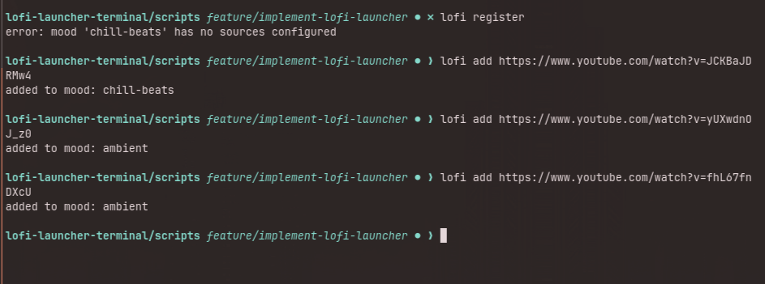
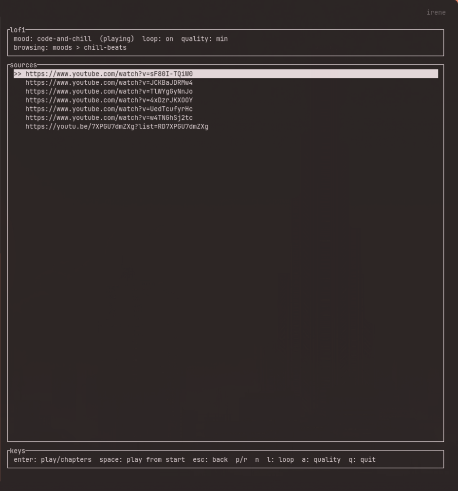
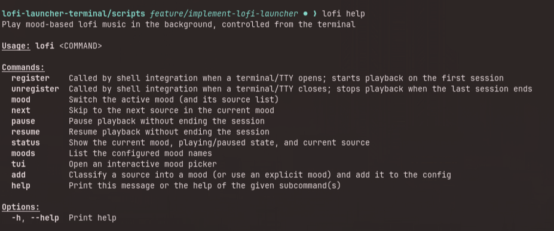

# lofi-launcher-terminal

Plays mood-based lofi music in the background for as long as any terminal
or TTY session is open on the machine.







## How it works

Opening a terminal or logging into a TTY runs `lofi register`, which starts
a shared background daemon on first use and starts playback through `mpv`.
Closing the session runs `lofi unregister`. Music keeps playing as long as
at least one session is open, and stops when the last one closes. All
terminals and TTYs share the same daemon and the same `mpv` process: opening
a second terminal while one is already playing increments a session count
and reuses the existing playback, it never starts a second track.

## Online vs. offline

Most lofi content people point this at lives on YouTube, so `lofi` is mostly
an online tool: `lofi add` fetches a URL's metadata over the network to
classify it, and playback of a URL source streams over the network through
mpv's ytdl hook. Point a mood's `sources` at local `.mp3`/`.flac`/etc. files
instead, and that mood plays entirely offline, no network access at all for
those sources. Mixing local and URL sources within the same mood is fine.

## Install

```sh
./scripts/install.sh
```

Open a new terminal afterward to pick up the shell integration.

## Update

```sh
./scripts/update.sh
```

The update stops a running `lofi-daemon` so the new binary takes over; the
new daemon starts on the next `lofi` command. Playback stops until a new
terminal opens, and terminals that were already open are not counted by the
new daemon.

## Uninstall

```sh
./scripts/uninstall.sh          # keeps your config
./scripts/uninstall.sh --purge  # also removes your config
```

## Arch Linux

A `PKGBUILD` is included for Arch-based distributions:

```sh
makepkg -si
```

## Configuring moods

Edit `~/.config/lofi-launcher/config.toml`, or use `lofi add` (below). Each
of the five built-in moods (`code-and-chill`, `deep-focus`, `chill-beats`,
`rainy-day`, `ambient`) takes a list of sources, where a source is a local
file/directory path or any URL mpv's built-in ytdl hook can resolve.
Synthwave, retrowave, and vaporwave are genre flavors: mix them into
whichever mood's list fits, they don't get their own mood keys. A long
source (a multi-hour YouTube mix, for example) is never downloaded or cut
into clips; mpv just seeks to a random point in it each time it's selected.

When a source finishes, playback moves on to the next source in the mood,
wrapping back to the first after the last. Set `loop_playback = false` in
`config.toml` (or run `lofi loop off`) to stop at the end of each source
instead.

The daemon reads `config.toml` once at startup, so after editing the file by
hand run `lofi reload` (or restart the daemon) for the changes to take
effect. `lofi add` always re-reads the file before appending, so it never
overwrites hand edits, though it does rewrite the file without its comments.

## CLI

```sh
lofi status            # show current mood, playing/paused/stopped, current source
lofi mood deep-focus    # switch mood
lofi next               # skip to the next source in the current mood
lofi pause / lofi resume
lofi moods              # list configured mood names
lofi reload             # re-read config.toml after editing it by hand
lofi loop on / lofi loop off  # auto-advance to the next source when one finishes (default on)
lofi add <url>          # classify a URL into a mood and add it
lofi add <url-or-path> --mood ambient  # add it to a specific mood directly
lofi tui                # interactive mood picker
```

Classification works from a URL's title and description, so `lofi add` on a
local file path always needs `--mood`. Local paths are stored as absolute
paths, so relative paths like `./mix.mp3` work from any directory.

Only one `lofi-daemon` runs per user. Every `lofi` command starts it on
demand, so you normally never run it yourself; if you do start
`lofi-daemon` by hand while one is already running, it prints "another
lofi-daemon is already running" and exits.

## Requirements

Linux, `mpv` installed and on `PATH` (or pointed to via `LOFI_MPV_BIN`). `yt-dlp` is needed for `lofi add` to classify a URL source and for mpv to stream URL sources at all; local file sources need neither.

## Now-playing widgets (quickshell, playerctl, waybar)

Install `mpv-mpris` (available in most distro repos, or as an optdepend on Arch) so mpv publishes track title and play/pause state over MPRIS. Any standard MPRIS-reading widget then sees and can control the current lofi track. This is optional: playback works the same without it, only widget visibility is affected. If your `mpv-mpris` script lives somewhere nonstandard, point to it with `LOFI_MPV_MPRIS_SCRIPT=/path/to/mpris.so`.

## Versioning (for maintainers)

`version.json` is the single source of truth for the project's version. To
bump it, edit `version.json` and run `./scripts/sync-version.sh`, which
propagates the version into `Cargo.toml` (every crate inherits it via
`version.workspace = true`) and `PKGBUILD`, rebuilds `Cargo.lock`, and
regenerates `.SRCINFO`. Review the resulting diff, then commit.
